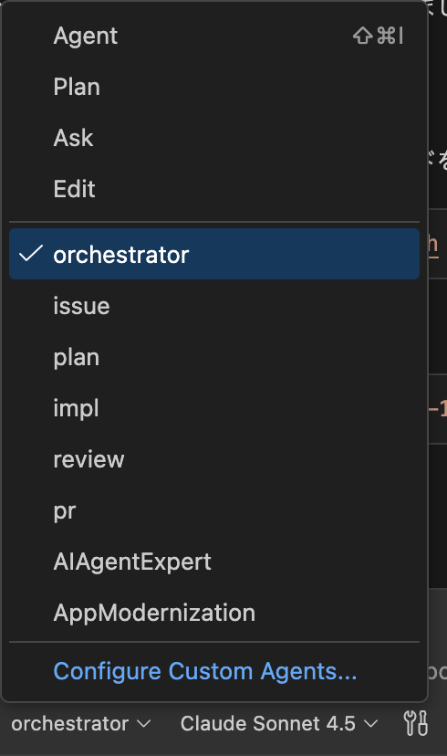
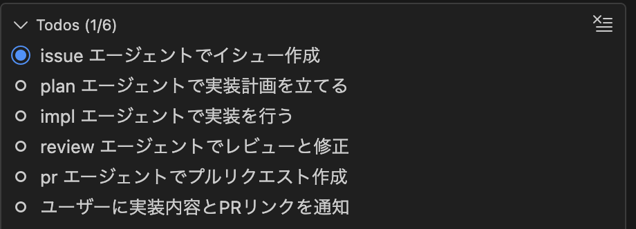

# ハンズオンチュートリアル: Copilot Orchestra で TODO アプリバックエンドを構築

このハンズオンガイドでは、GitHub Copilot Orchestra を使用して TODO アプリケーションのバックエンドを構築する手順を説明します。複数の AI エージェントを活用して開発ワークフローを効率化する方法を学びます。

## 🎯 学習目標

このチュートリアルを完了すると、以下ができるようになります:
- 必要なツールを備えた dev container 環境をセットアップ
- Copilot Orchestra ワークフローの理解
- TypeScript と Express で REST API を構築
- TODO アイテムの CRUD 操作を実装
- Web プッシュ通知サポートを追加
- テストを記述してコード品質を確保
- AI 支援ワークフローを使用してプルリクエストを作成

## 📚 前提条件

開始する前に、以下を確認してください:
- TypeScript/JavaScript の基本知識
- REST API の基本的な理解
- Docker Desktop がインストール済み
- Dev Containers 拡張機能を含む VS Code
- GitHub Copilot サブスクリプション
- GitHub アカウント

## 🏁 パート 1: 環境セットアップ

### ステップ 1.1: Dev Container でプロジェクトを開く

1. VS Code でこのプロジェクトを開く
2. "Reopen in Container" のプロンプトが表示されたら、**Reopen in Container** をクリック
   - または `F1` を押して `Dev Containers: Reopen in Container` を選択
3. コンテナのビルドを待つ(初回は約 2〜3 分)
4. 完了すると、以下を含む完全に構成された環境が利用可能になります:
   - Node.js 20
   - Git CLI
   - GitHub CLI (gh)
   - GitHub Copilot
   - Web Search for Copilot 拡張機能

### ステップ 1.2: 環境を確認

統合ターミナルを開いて実行:

```bash
# Node.js バージョンを確認
node --version  # v20.x.x が表示されるはず

# Git を確認
git --version

# GitHub CLI を確認
gh --version

# npm パッケージがインストールされているか確認
npm list
```

### ステップ 1.3: GitHub CLI を認証

```bash
gh auth login
```

プロンプトに従って GitHub アカウントで認証します。

## 🤖 パート 2: Copilot Orchestra を理解する

Copilot Orchestra は複数の専門化された AI エージェントを調整します:

```
ユーザーリクエスト
    ↓
[Orchestrator Agent] ← 現在ここ
    ↓
    ├─→ [Issue Agent] ────→ GitHub Issue を作成
    ↓
    ├─→ [Plan Agent] ─────→ 実装計画を設計
    ↓
    ├─→ [Impl Agent] ─────→ コードを記述
    ↓
    ├─→ [Review Agent] ───→ コードをレビューして改善
    ↓
    └─→ [PR Agent] ───────→ プルリクエストを作成
```

### 主要概念

1. **Orchestrator Agent**: 全体のワークフローを管理
2. **Issue Agent**: 要件を理解し、詳細なイシューを作成
3. **Plan Agent**: タスクを実行可能なステップに分解
4. **Implementation Agent**: 計画に従ってコードを記述
5. **Review Agent**: コード品質とベストプラクティスを確保
6. **PR Agent**: 包括的なプルリクエストを作成

## 🔨 パート 3: TODO API を構築

### ステップ 3.1: 既存のコード構造を探索

まず、現在の構成を理解しましょう:

```bash
# 現在の構造を表示
tree -L 2 src/
```

以下が表示されます:
- `server.ts` - エントリーポイント
- `config/` - 設定管理
- `services/` - ビジネスロジック
- `types/` - TypeScript 定義
- `utils/` - ヘルパー関数

### ステップ 3.2: 開発サーバーを起動

```bash
npm run dev
```

サーバーは `http://localhost:3000` で起動します。ターミナルにログが表示されます。

### ステップ 3.3: 現在の API をテスト

新しいターミナルを開いて既存のエンドポイントをテスト:

```bash
# ヘルスチェック
curl http://localhost:3000/health

# todo をリスト(初期状態では空のはず)
curl http://localhost:3000/api/todos
```

### ステップ 3.4: TODO 操作を理解する

API は以下の操作をサポートします:

| メソッド | エンドポイント | 説明 |
|--------|--------------|------|
| GET | `/api/todos` | すべての todo をリスト |
| GET | `/api/todos/:id` | 特定の todo を取得 |
| POST | `/api/todos` | 新しい todo を作成 |
| PUT | `/api/todos/:id` | todo を更新 |
| DELETE | `/api/todos/:id` | todo を削除 |

## 🧪 パート 4: Copilot を使った作業

### ステップ 4.1: Copilot Chat を使用

1. Copilot Chat を開く (Mac では `Ctrl+Cmd+I`、Windows/Linux では `Ctrl+Shift+I`)
2. 試しに質問:
   ```
   @workspace この API に新しいエンドポイントを追加するにはどうすればよいですか?
   ```

3. Copilot がワークスペースを分析し、コンテキストに応じた提案を提供します

### ステップ 4.2: インライン提案

1. `src/server.ts` を開く
2. コメントを入力開始: `// todo を完了としてマークするエンドポイントを追加`
3. `Delegate to agent` を押して Copilot のコード提案を確認

### ステップ 4.3: タスクをオーケストレーターエージェントに依頼

1. Copilot Chat を開き、`orchestrator` を選択



2. `期限の1日前に Web Push をする機能を実装したい` と入力

3. 以下のような Todos が作成されることを確認

- issue エージェントで GitHub issue を作成
- plan エージェントで実装計画を立てる
- impl エージェントで実装を行う
- review エージェントでコードレビューを行う



**表記は異なることがある点にご留意ください。orchestrator エージェントが、各エージェントにタスクを分配していることが確認できればOKです。**

## 🎯 練習問題

### 演習 1: 「期限」機能を追加
検証付きで TODO アイテムに期限機能を追加します。

### 演習 2: フィルタリングを実装
ステータスまたは優先度で todo をフィルタリングするクエリパラメータを追加します。

### 演習 3: ページネーションを追加
todo リストエンドポイントにページネーションを実装します。

### 演習 4: 検索エンドポイントを作成
todo のタイトルと説明に全文検索機能を追加します。

## 🐛 トラブルシューティング

### コンテナがビルドされない
- Docker が実行中か確認
- 再ビルドを試す: `Dev Containers: Rebuild Container`

### Copilot が動作しない
- サブスクリプションがアクティブか確認
- 拡張機能が有効か確認
- VS Code の再読み込みを試す

## 📚 ご参考

- [GitHub Copilot ドキュメント](https://docs.github.com/ja/copilot)
- [copilot-orchestra](https://github.com/ShepAlderson/copilot-orchestra)